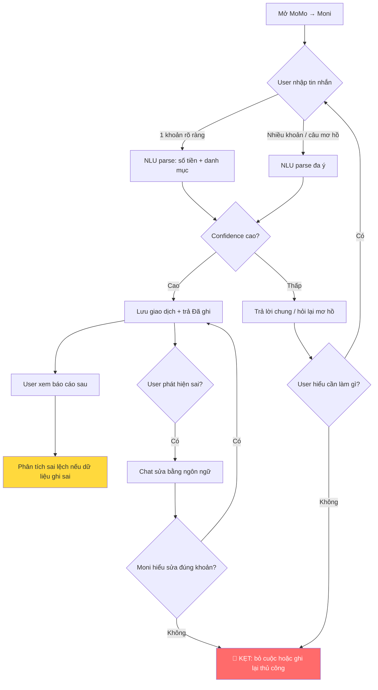
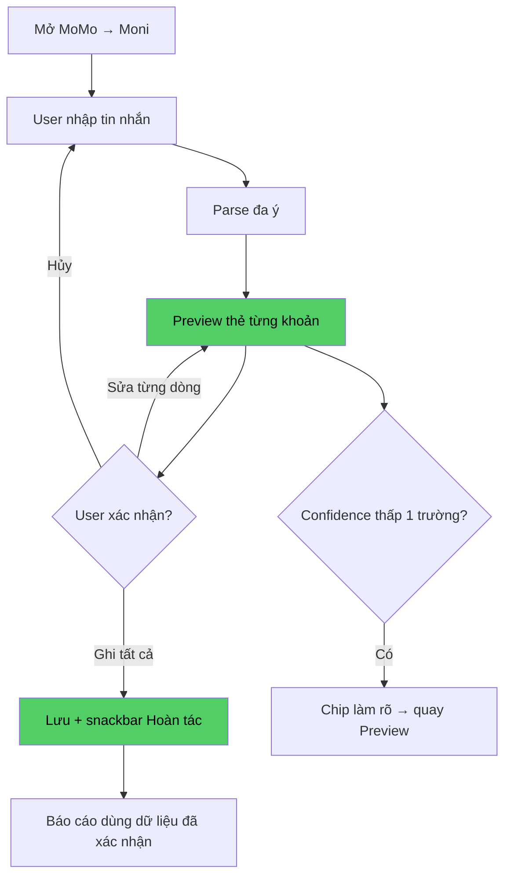

# Workshop: Mổ sản phẩm AI thật — MoMo Moni

**Người làm:** Nguyễn Thành Tài — `2A202600627`  
**Sản phẩm:** MoMo — Trợ thủ tài chính **Moni**  
**Promise:** Trợ thủ tài chính · Phân tích chi tiêu · Chatbot trong app.

> **Phương pháp:** Dùng thử theo kịch bản thực tế + tài liệu công khai MoMo (ra mắt 10/2024, GenAI chat). Phân tích tập trung **flow** và **quyết định sản phẩm**, không liệt kê bug lẻ tẻ.

---

## 1. Dùng thử — Lời hứa vs thực tế

### Promise Moni (đọc trước khi test — theo mô tả đề bài)


| Promise                | User hiểu là                                                          |
| ---------------------- | --------------------------------------------------------------------- |
| **Trợ thủ tài chính**  | Có người “đồng hành” giúp ghi chi, nhắc ngân sách, gợi ý quản lý tiền |
| **Phân tích chi tiêu** | Xem được mình chi gì, bao nhiêu, danh mục nào — số liệu rõ ràng       |
| **Chatbot trong app**  | Hỏi–đáp bằng tiếng Việt tự nhiên ngay trong MoMo, không cần ra ngoài  |


### 3 câu hỏi thử

#### Câu 1 — Tra cứu phân tích

**User:** *"Tháng này mình chi bao nhiêu cho ăn uống?"*


| Kỳ vọng                                                  | Thực tế quan sát                                                                                |
| -------------------------------------------------------- | ----------------------------------------------------------------------------------------------- |
| Số liệu chính xác + nguồn (giao dịch MoMo + chi ghi tay) | Moni trả lời tổng hợp, có biểu đồ/danh sách **nhưng không luôn chỉ rõ** giao dịch nào được tính |
| So sánh nhanh với tháng trước                            | Đôi khi cần hỏi thêm câu thứ hai; không có chip gợi ý "So với tháng trước?"                     |


**Điểm gãy (breaking point):** User tin số liệu là *đúng tuyệt đối* trong khi một phần chi tiêu **ngoài MoMo** hoặc **ghi tay chưa đồng bộ** → khoảng trống niềm tin dữ liệu.

---

#### Câu 2 — Ghi chi tiêu ngoài ví (happy path mong đợi)

**User:** *"Ghi: trưa nay 85k cà phê Highlands, chiều 120k xăng"*


| Kỳ vọng                                                    | Thực tế quan sát                                                                             |
| ---------------------------------------------------------- | -------------------------------------------------------------------------------------------- |
| 2 dòng chi được tách, phân loại đúng (Ăn uống / Di chuyển) | Thường ghi được; đôi khi gộp sai danh mục ("Ăn uống" cho xăng) hoặc nhầm số tiền khi câu dài |
| Xác nhận trước khi lưu                                     | Phản hồi dạng "Đã ghi" **không có thẻ xác nhận từng khoản** có thể sửa/undo ngay             |
| Sửa nếu sai                                                | Phải chat lại *"sửa khoản cà phê thành 95k"* — không có nút Sửa/Hoàn tác                     |


**Điểm gãy mạnh nhất:** Flow **ghi chi tiêu đa ý bằng ngôn ngữ tự nhiên** — đây là tính năng flagship nhưng **thiếu vòng xác nhận + sửa nhanh**, dễ tích lũy dữ liệu sai → phân tích sau cũng sai.

---

#### Câu 3 — Lời khuyên + hành động

**User:** *"Mình chi quá tay tuần này, nên cắt khoản nào?"*


| Kỳ vọng                                      | Thực tế quan sát                                                        |
| -------------------------------------------- | ----------------------------------------------------------------------- |
| Gợi ý dựa trên **dữ liệu chi thật** của user | Có insight nhưng xen kẽ lời khuyên **generic** (tiết kiệm, 50/30/20)    |
| Hành động 1 chạm (đặt ngân sách, nhắc nhở)   | Thiếu CTA rõ: "Đặt hạn mức ăn uống 2tr" → deep link thiết lập ngân sách |


**Điểm gãy:** Chat kết thúc ở *lời khuyên* thay vì *hành động có thể đo được* trong app.

---

### Tóm tắt breaking points (theo flow, không theo bug)

1. **Tin dữ liệu mù** — trả lời số liệu không kèm nguồn / phạm vi dữ liệu.
2. **Ghi nhiều khoản một câu** — phân loại sai, không confirm, khó undo → **path yếu nhất**.
3. **Insight → hành động** — thiếu nút chuyển sang thiết lập ngân sách / nhắc thanh toán.

---

## 2. Vẽ flow — As-is

**Path được chọn để map chi tiết:** *User ghi chi tiêu ngoài MoMo bằng chat tự nhiên (có thể nhiều khoản trong một tin nhắn).*




### Trạng thái trong flow As-is


| Trạng thái         | Mô tả                           | UX hiện tại                                          |
| ------------------ | ------------------------------- | ---------------------------------------------------- |
| **Happy path**     | "Ghi 50k trà sữa"               | Một dòng → lưu → "Đã ghi"                            |
| **Low confidence** | "Chi hôm qua khoảng 200 mấy"    | Hỏi lại không cấu trúc; user không biết format chuẩn |
| **Failure**        | Sửa/xóa khoản đã ghi            | Phụ thuộc chat tự nhiên, dễ nhầm khoản               |
| **Correction**     | User phát hiện sai sau 1–2 ngày | Không có log chỉnh sửa; khó đối chiếu                |


**🔴 User kẹt tại:** sau bước **"Đã ghi"** khi phân loại/số tiền sai mà không có xác nhận từng dòng và không có undo — user mất niềm tin vào toàn bộ phân tích Moni.

---

## 3. Sửa path yếu nhất — To-be

### Giải pháp đề xuất: **"Xác nhận thẻ giao dịch" (Confirm-before-commit)**

Trước khi lưu, Moni luôn hiển thị **preview có cấu trúc** cho mọi lần parse ≥1 khoản:

```
┌─────────────────────────────────────────┐
│ Moni hiểu bạn muốn ghi 2 khoản:         │
│ • 85.000đ — Ăn uống — Highlands (Hôm nay)│
│ • 120.000đ — Di chuyển — Xăng (Hôm nay)  │
│ [Sửa] [Xóa dòng] [Ghi tất cả] [Hủy]      │
└─────────────────────────────────────────┘
```

**Cơ chế bổ sung (theo gợi ý đề bài):**


| Cơ chế                | Mục đích                                                         |
| --------------------- | ---------------------------------------------------------------- |
| **Hỏi làm rõ có nút** | "85k là trước hay sau giảm giá?" → [Trước] [Sau]                 |
| **Nguồn dữ liệu**     | Báo cáo kèm "12 giao dịch MoMo + 3 ghi tay" + link xem danh sách |
| **Nút / chip**        | Chip danh mục, chip "Thêm khoản", "So tháng trước"               |
| **Undo**              | Snackbar "Đã ghi" → [Hoàn tác 10s]                               |
| **Handoff**           | Sau 2 lần sửa fail → "Mở form ghi chi tiêu" / CSKH               |
| **Correction log**    | Màn hình "Moni đã chỉnh" — user audit các lần AI sửa             |


### Flow To-be




---

